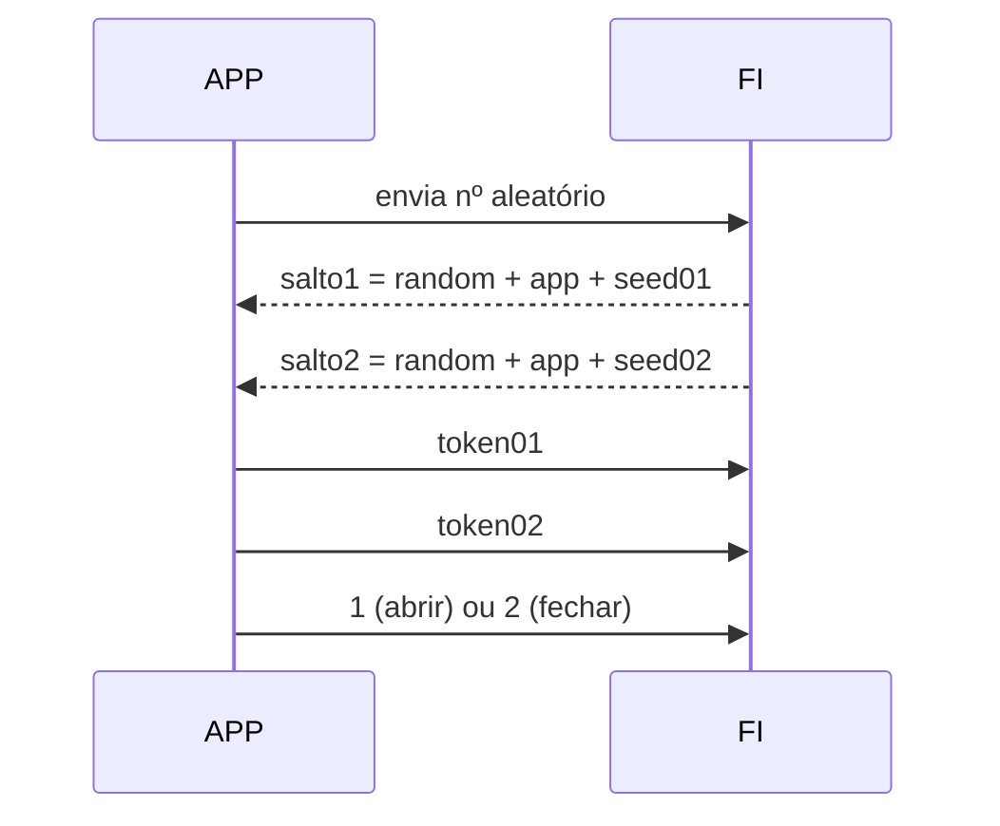
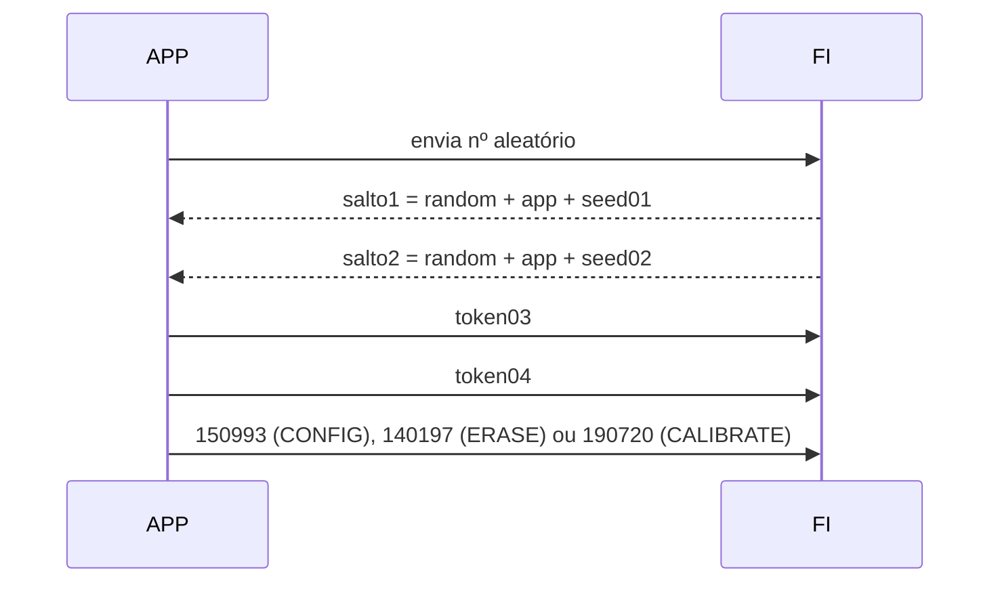

## OPEN ou CLOSE

```mermaid
sequenceDiagram
    APP ->> FI : envia nº aleatório
    FI -->> APP : salto1 = random + app + seed01
    FI -->> APP : salto2 = random + app + seed02
    APP ->> FI : token01
    APP ->> FI : token02
    APP ->> FI : 1 (abrir) ou 2 (fechar)
```

## CONFIG, ERASE ou CALIB

```mermaid
sequenceDiagram
    APP ->> FI : envia nº aleatório
    FI -->> APP : salto1 = random + app + seed01
    FI -->> APP : salto2 = random + app + seed02
    APP ->> FI : token03
    APP ->> FI : token04
    APP ->> FI : 150993 (CONFIG), 140197 (ERASE) ou 190720 (CALIBRATE)
```
