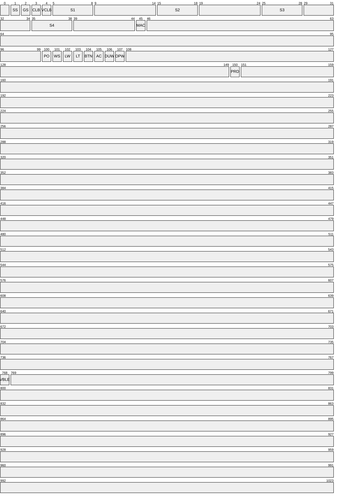

|Símbolo|Descrição                |Início|Fim|Tamanho|Tipo           |
|-------|-------------------------|------|---|-------|---------------|
|SS     |setupSeedOk              |1     |1  |1      |`char`         |
|GS     |generalSetupOk           |2     |2  |1      |`char`         |
|CLB    |calibrationOk            |3     |3  |1      |`char`         |
|VCLB   |verifierCalibration      |4     |4  |1      |`char`         |
|S1     |address01Seed01          |5     |8  |4      |`unsigned long`|
|S2     |address01Seed02          |15    |18 |4      |`unsigned long`|
|S3     |address01Seed03          |25    |28 |4      |`unsigned long`|
|S4     |address01Seed04          |25    |38 |4      |`unsigned long`|
|MAC    |address01MAC             |45    |45 |1      |               |
|PO     |flagProximityOpening     |100   |100|1      |`char`         |
|WS     |flagWarningSound         |101   |101|1      |`char`         |
|LW     |flagLightWarning         |102   |102|1      |`char`         |
|LT     |flagLockTurns            |103   |103|1      |`char`         |
|BTN    |flagButton               |104   |104|1      |`char`         |
|AC     |flagAutomaticClosing     |105   |105|1      |`char`         |
|DUW    |flagDoorUnloockingWarning|106   |106|1      |`char`         |
|OPW    |flagOpenDoorWarning      |107   |107|1      |`char`         |
|PRD    |setupProductionOk        |150   |150|1      |`char`         |
|VBLE   |VersBLE                  |768   |768|1      |`char`         |

